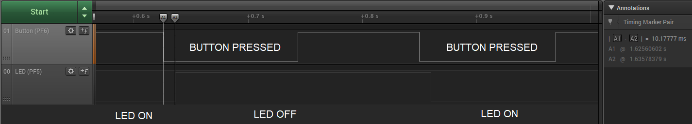

# Getting Started with GPIO Using the AVR64DD32 Microcontroller

 The repository contains four MPLAB® X projects:

1.  [Blink LED](#1-blink-led) – This project shows how to toggle a pin connected to a LED.
2.  [Long and Short Button Press](#2-long-and-short-button-press) – This project uses a pin as input to distinguish between a long and short button press, defined by a delay threshold.
3.  [Multi-Pin Configuration](#3-multi-pin-configuration) – This project shows how to set up pins using the PORT Multi-Pin Configuration register.
4.  [Wake up on Button Press](#4-wake-up-on-button-press) – This project sets the microcontroller to exit Sleep on button press, turn on a LED and go back to Sleep. Once the button is released, the microcontroller exits Sleep, turns off the LED and goes back to Sleep.

## Related Documentation

More details and code examples on the AVR64DD32 can be found at the following links:

- [AVR64DD32 Product Page](https://www.microchip.com/wwwproducts/en/AVR64DD32)
- [AVR64DD32 Code Examples on GitHub](https://github.com/microchip-pic-avr-examples?q=AVR64DD32)
- [AVR64DD32 Project Examples in START](https://start.atmel.com/#examples/AVR64DD32CuriosityNano)

## Software Used

- [MPLAB® X IDE](http://www.microchip.com/mplab/mplab-x-ide) v6.00 or newer
- [MPLAB® XC8](http://www.microchip.com/mplab/compilers) v2.36 or newer
- [AVR-Dx Series Device Pack](https://packs.download.microchip.com/) v2.1.152 or newer

## Hardware Used

- The AVR64DD32 Curiosity Nano Development Board is used as a test platform
   
- Logic Analyzer

## Operation

To program the Curiosity Nano board with this MPLAB® X project, follow the steps provided in the [How to Program the Curiosity Nano Board](#how-to-program-the-curiosity-nano-board) chapter.  

## 1. Blink LED

This project shows how to make the on-board LED on the Curiosity Nano Development board blink. The LED is connected to a GPIO pin and spends 500 ms in ON state and 500 ms in OFF state.

### 1.1 Setup 

The following configurations must be made for this project:

- CPU clock frequency is 4 MHz

| Pin | Configuration  |
| :-: | :------------: |
| PF5 | Digital output |

### 1.2 Demo

The image below shows the waveform from the logic analyzer connected to the PF5 pin (LED). The pin changes its state every 500 ms.

 

### 1.3 Summary

This project shows how to make the LED blink every 500 ms.
  
[Back to top](#getting-started-with-gpio-using-the-avr64dd32-microcontroller) 

## 2. Long and Short Button Press

This project uses the on-board push button of the Curiosity Nano Development board as an input and detects short and long presses (defined by a delay threshold). The on-board LED blink rate is low, if a long press is detected, and high, if a short press is detected.

### 2.1 Setup 

The following configurations must be made for this project:

- CPU clock frequency is 4 MHz
- Pin PF6 has internal pull-up enabled

| Pin | Configuration  |
| :-: | :------------: |
| PF5 | Digital output |
| PF6 | Digital input|

### 2.2 Demo

The image below illustrates two sequences. The first one is a short button press, followed by a fast LED blink, and the next one is a long button press with a slow LED blink. The slow LED blinking begins approximately 1 s after the button has been pressed.

 

### 2.3 Summary

The GPIO interface can be used to sense external digital signals to make certain decisions. In this code example, the focus is on pushing a button. An LED’s blink rate is slow if a long press is detected and high if a short press is detected.
  
[Back to top](#getting-started-with-gpio-using-the-avr64dd32-microcontroller) 

## 3. Multi-Pin Configuration

This code demonstrates the capabilities of the GPIO peripheral. It starts by making the LED blink, but involves having the PORT Multi-Pin Configuration register set all PORTs instead of writing down a line for each separate pin. When the button is pressed, the LED will blink at a lower rate. Otherwise, when the button is released it will blink at a higher rate.

### 3.1 Setup 

The following configurations must be made for this project:

- CPU clock frequency is 4 MHz
- Global interrupts enabled
- Pin PF6 (push-button) is set as digital input with pull-up enabled and interrupt set to "Sense Both Edges"

| Pin | Configuration  |
| :-: | :------------: |
| PF2 | Digital output |
| PF3 | Digital output |
| PF4 | Digital output |
| PF5 | Digital output – LED |
| PF6 | Digital input – Button, active low |

### 3.2 Demo

The program makes the PORTF pins PF2, PF3, PF4 and PF5 toggle with a set frequency. When the button on PF6 pin is pressed, an interrupt is issued and the blinking rate slows down. Releasing the button returns the blinking to the normal frequency.

The image below illustrates the behavior of the above mentioned pins, depending on the state of the push button. If the button is pressed, the blinking rate is lower and if the button is released, the switching rate is higher.

 

### 3.3 Summary

This code example shows how to configure the PORTF pins and how to toggle them with the Multi-Pin Configuration registers.
  
[Back to top](#getting-started-with-gpio-using-the-avr64dd32-microcontroller) 

## 4. Wake Up on Button Press

This use case demonstrates how to wake up the microcontroller from Sleep mode by pressing a button. The microcontroller exits Sleep mode on button press, toggles the on-board LED and goes back to Sleep. On button release, the microcontroller exits Sleep mode, toggles again the LED then goes back to Sleep.

### 4.1 Setup 

The following configurations must be made for this project:

- CPU clock frequency is 4 MHz
- Power-Down Sleep mode set
- Global interrupts enabled
- Interrupt on change enabled for PF6 pin (push button)
- Pin PF6 configured with internal pull-up

| Pin | Configuration  |
| :-: | :------------: |
| PF5 | Digital output |
| PF6 | Digital input  |

### 4.2 Demo

The image below shows the behavior of the on-board LED when the push button is pressed and released twice.
After the button event occured, the microcontroller exits the Sleep mode, waits for 10 ms, then, if button is still pressed, toggles the LED and goes back to Sleep.

 

### 4.3 Summary

This use case demonstrates how to wake up the microcontroller from Sleep mode by pressing a push button.
  
[Back to top](#getting-started-with-gpio-using-the-avr64dd32-microcontroller) 

#

##  How to Program the Curiosity Nano Board

This chapter demonstrates how to use the MPLAB® X IDE to program an AVR® device with an Example_Project.X. This can be applied to any other projects.

1.  Connect the board to the PC.

2.  Open the Example_Project.X project in MPLAB® X IDE.

3.  Set the Example_Project.X project as main project.
     Right click the project in the **Projects** tab and click **Set as Main Project**.
     

4.  Clean and build the Example_Project.X project.
     Right click the **Example_Project.X** project and select **Clean and Build**.
     

5.  Select the **AVRxxxxx Curiosity Nano** in the Connected Hardware Tool section of the project settings:
     Right click the project and click **Properties**.
     Click the arrow under the Connected Hardware Tool.
     Select **AVRxxxxx Curiosity Nano** (click the **SN**), click **Apply** and then **OK**.
     

6.  Program the project to the board.
     Right click the project and click **Make and Program Device**.
     

 

- [Back to 1. Blink LED](#1-blink-led) 
- [Back to 2. Long and Short Button Press](#2-long-and-short-button-press) 
- [Back to 3. Multi-Pin Configuration](#3-multi-pin-configuration) 
- [Back to 4. Wake up on Button Press](#4-wake-up-on-button-press)
- [Back to top](#getting-started-with-gpio-using-the-avr64dd32-microcontroller)
